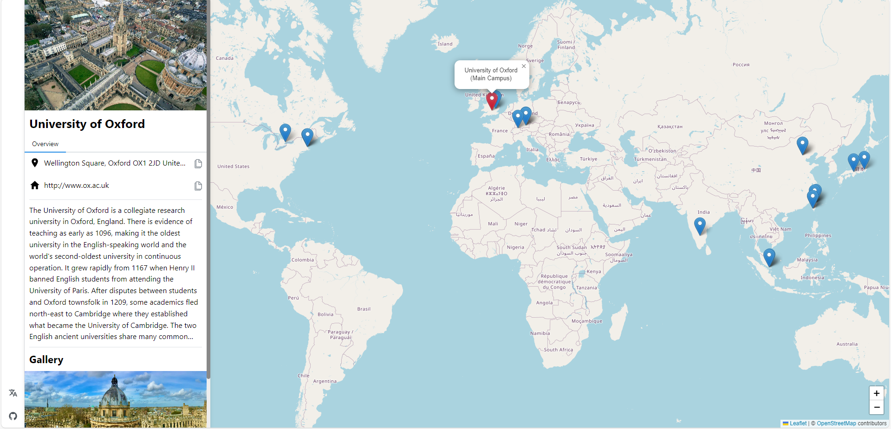

# University Map



This is the original project for the [University Map](https://github.com/university-map/university-map) using NextJS 14 App Routing. This repository is not actively maintained because it cannot be exported as a static website and hosted on Github Pages.

## How to Run

Install NodeJS v20.10.0.
Install Python 3 and install `PyYAML`.

```bash
# Generate or update public/universities/locations.json
cd university-map
python scripts/build-index.py

npm install
npm run dev
```

Go to http://localhost:3000.

## Acknowledgments for Data and Code Sources

- Wikipedia
- Google Map
- Unsplash
- OpenStreetMap, Leaflet, and all free software
- Each University's Official Website